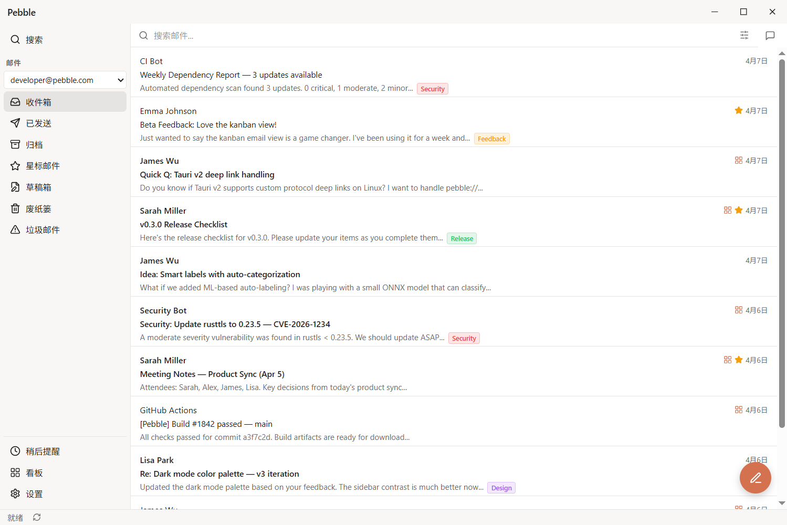
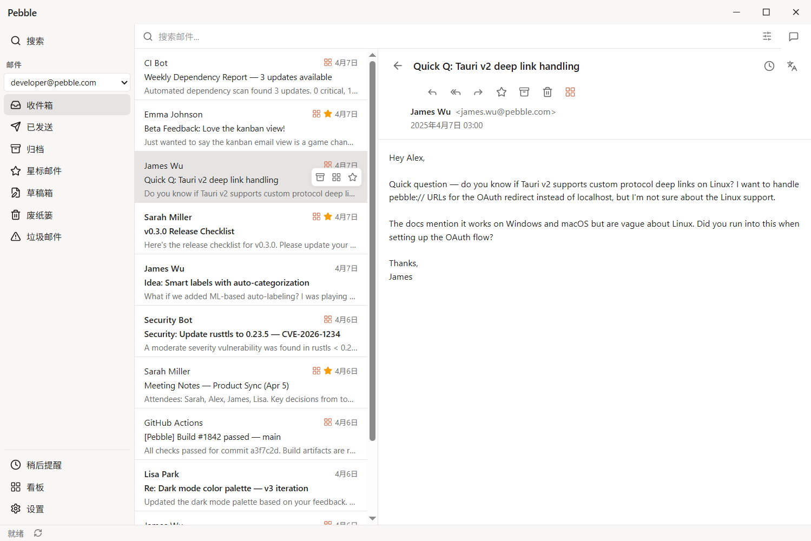
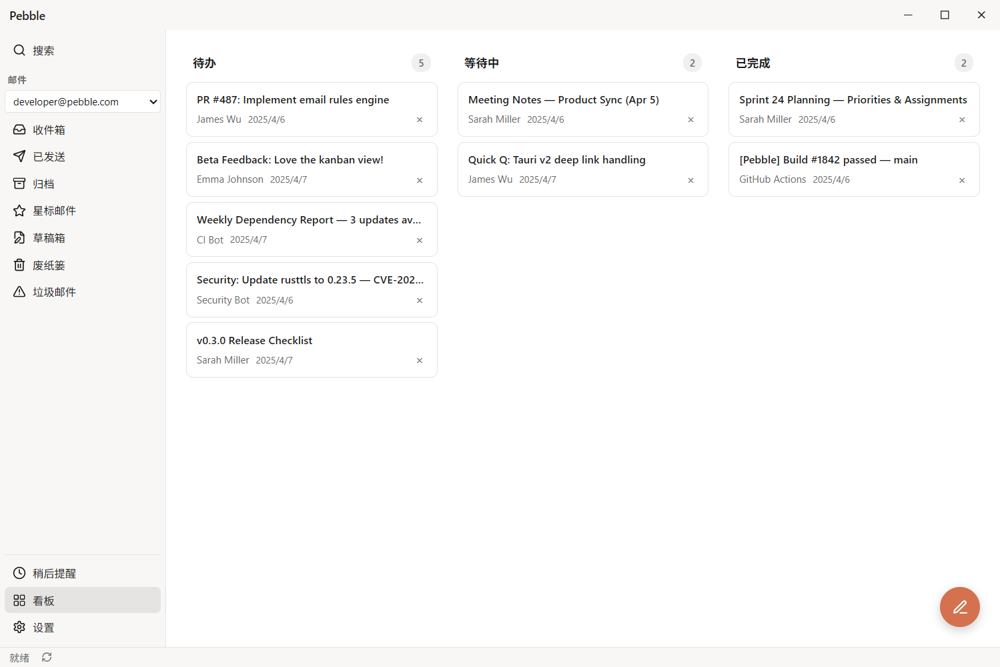
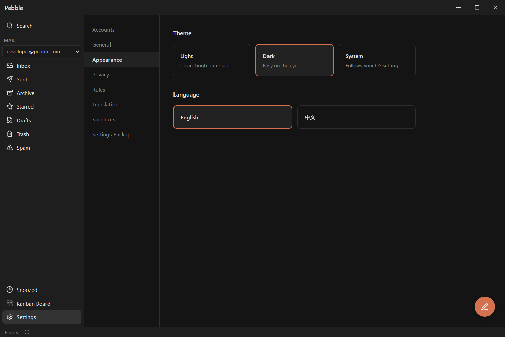
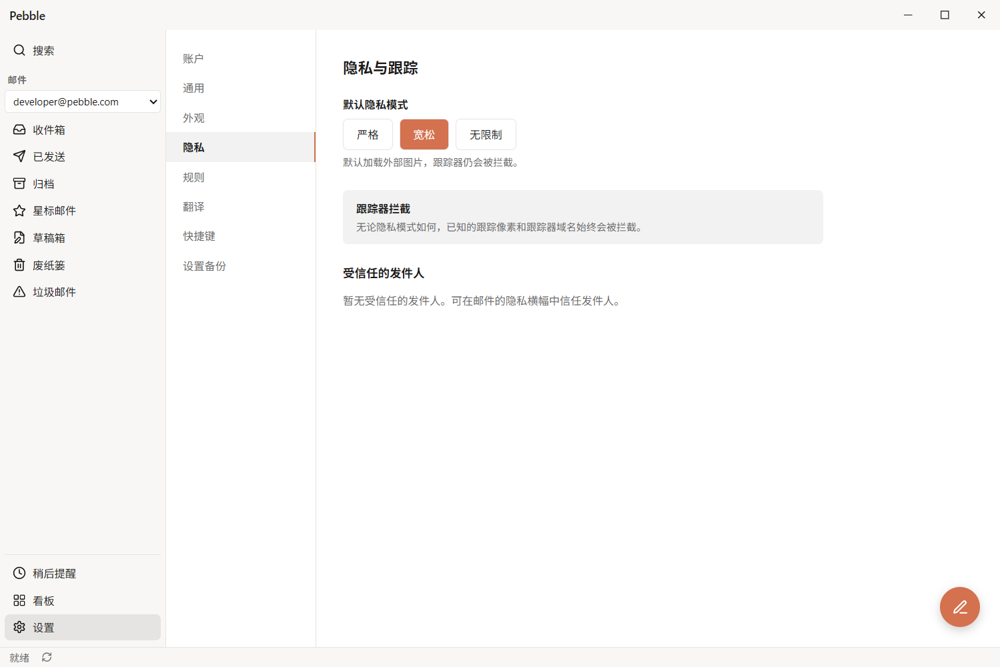

<p align="center">
  
</p>

<h1 align="center">Pebble</h1>

<p align="center">
  A privacy-first desktop email client built with Rust and React.
  <br>
  Local-first: mail, search index, and attachments stay on your device. No telemetry. Outbound traffic only for features you configure — mail sync, translation, and WebDAV settings backup.
</p>

<p align="center">
  <a href="https://github.com/QingJ01/Pebble/releases"></a>
  <a href="LICENSE"></a>
  <a href="https://github.com/QingJ01/Pebble/actions"></a>
  
</p>

---

## Features

**Privacy & Security**
- Local-first storage — SQLite database, search index, attachments all on your device
- AES-256 encrypted OAuth tokens and credentials with per-device key
- No telemetry. Outbound network traffic only for features you enable: mail sync with your provider, translation (sends the selected text to the service you configure), and WebDAV settings backup (runs against the server you provide)
- Data retention: deleted messages are soft-deleted and purged after 30 days; use "Empty Trash" to permanently remove them immediately
- Open source under AGPL-3.0

**Email Management**
- Gmail, Outlook (experimental), and IMAP support — all accounts in one place
- Kanban board — drag emails across Todo, Waiting, and Done columns
- Smart search powered by Tantivy full-text search engine
- Snooze & Star — resurface emails later, mark what matters
- Rules engine — auto-label, move, or flag with custom conditions

**User Experience**
- Dark & Light themes with system-aware auto-switching
- Keyboard-friendly navigation — core actions (compose, reply, archive, search, navigate) have shortcuts; see the table below
- Built-in translation with DeepL / LLM bilingual view
- i18n support — English and Chinese built-in

## Screenshots

<table>
  <tr>
    <td><br><b>Inbox</b> — Three-panel layout</td>
    <td><br><b>Kanban</b> — Drag-and-drop email board</td>
  </tr>
  <tr>
    <td><br><b>Dark Mode</b> — Beautiful dark theme</td>
    <td><br><b>Settings</b> — Privacy & appearance</td>
  </tr>
</table>

## Tech Stack

| Layer | Technology |
|-------|-----------|
| Backend | Rust |
| Desktop Framework | Tauri v2 |
| Frontend | React 19 + TypeScript |
| State Management | Zustand + TanStack Query |
| Database | SQLite (rusqlite) |
| Search | Tantivy |
| Styling | Tailwind CSS |
| i18n | i18next |

## Getting Started

### Prerequisites

- [Rust](https://www.rust-lang.org/tools/install) (latest stable)
- [Node.js](https://nodejs.org/) (v18+)
- [pnpm](https://pnpm.io/) (v8+)

### Setup

```bash
# Clone the repository
git clone https://github.com/QingJ01/Pebble.git
cd Pebble

# Install frontend dependencies
pnpm install

# Set up environment variables
cp .env.example .env
# Edit .env with your OAuth credentials (see below)

# Run in development mode
pnpm dev
```

### OAuth Configuration

To use Gmail or Outlook, you need OAuth credentials:

| Variable | Description |
|----------|-------------|
| `GOOGLE_CLIENT_ID` | Google OAuth 2.0 Client ID (Desktop app type; uses PKCE) |
| `GOOGLE_CLIENT_SECRET` | Optional. Set this if Google returns `client_secret is missing` during login. |
| `MICROSOFT_CLIENT_ID` | Microsoft Azure public/native app Client ID (no secret needed; uses PKCE) |
| `MICROSOFT_CLIENT_SECRET` | Optional. Only set this for confidential/web Microsoft app registrations; public/native clients should leave it unset. |

See `.env.example` for the full template.

### Build

```bash
# Build the desktop app
pnpm build
```

Build artifacts will be under `target/release/` and `target/release/bundle/`.

## Project Structure

```
Pebble/
├── src/                    # React frontend
│   ├── components/         # Shared UI components
│   ├── features/           # Feature modules (inbox, kanban, settings...)
│   ├── hooks/              # React hooks & mutations
│   ├── stores/             # Zustand state stores
│   └── lib/                # Utilities, API, i18n
├── src-tauri/              # Tauri backend
│   └── src/commands/       # Tauri IPC commands
├── crates/                 # Rust workspace crates
│   ├── pebble-core/        # Shared types & errors
│   ├── pebble-store/       # SQLite persistence
│   ├── pebble-mail/        # Email sync (Gmail, IMAP)
│   ├── pebble-search/      # Tantivy search index
│   ├── pebble-crypto/      # AES-256 encryption
│   ├── pebble-oauth/       # OAuth 2.0 + PKCE flow
│   ├── pebble-rules/       # Rules engine
│   ├── pebble-translate/   # Translation providers
│   └── pebble-privacy/     # Privacy utilities
└── site/                   # Landing page (static HTML)
```

## Keyboard Shortcuts

| Key | Action |
|-----|--------|
| `J` / `K` | Navigate up / down |
| `Enter` | Open email |
| `E` | Archive |
| `S` | Toggle star |
| `R` | Reply |
| `A` | Reply all |
| `F` | Forward |
| `C` | Compose new email |
| `/` | Focus search |
| `Esc` | Close / go back |

## Contributing

Contributions are welcome! Please feel free to submit issues and pull requests.

1. Fork the repository
2. Create your feature branch (`git checkout -b feature/amazing-feature`)
3. Commit your changes (`git commit -m 'Add amazing feature'`)
4. Push to the branch (`git push origin feature/amazing-feature`)
5. Open a Pull Request

## License

This project is licensed under the [GNU Affero General Public License v3.0](LICENSE).

---

<p align="center">
  Built with care by <a href="https://github.com/QingJ01">QingJ</a>
</p>
